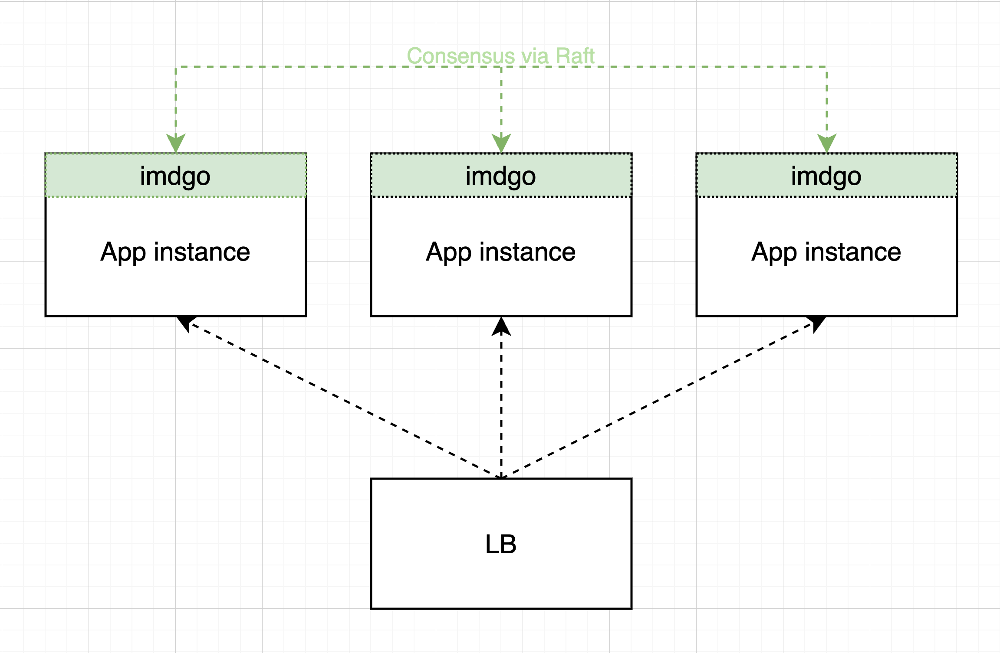

# IMDGO - In-Memory Data Grid in Go

Or simply - a light-weight distributed in-memory key-value store inspired primarily by Hazelcast.

IMDGO is built on top of Raft consensus protocol ([Hashicorp's implementation](https://github.com/hashicorp/raft)) where all
write (set and delete) operations are done through Raft and reads are done from a local replica.



Because of the leader based replication with Raft, every write and delete operation go to the leader (in case request hits a follower node)
and then are replicated to followers.
Currently, these requests are forwarded via plain old HTTP with JSON, but it will be done with MessagePack or gRPC.

It uses [orcaman/concurrent-map](https://github.com/orcaman/concurrent-map) as an underlining map to reduce locking and contention as much as possible.

Upcoming features:
- data partitioning (currently every node hols all the data)
- multiple distinct maps
- item TTL and eviction
- memory usage management (set the percentage of the app's memory for imdgo)
- store management API

Beside the new stuff, there are non-functional things to improve and for sure bugs to fix.

## Quickstart

Import the package:

```go
import (
    "github.com/inelpandzic/imdgo"
)
```
```shell
go get "github.com/inelpandzic/imdgo"
```

### Usage

```go
// set the members of your application cluster
c := &imdgo.Config{Members: []string{"192.168.10.1", "192.168.10.2", "192.168.10.3"}}
store, err := imdgo.New(c)
if err != nil {
    panic(err)
}
defer store.Close()

key := "my-key"

// You can set the value on one node or application instance
err := store.Set(key, "and my value which can be anything, not just string")
if err != nil {
    log.Error(err))
}

// And then you can get it on some other application instance, safely replicated
if val, ok := m.Get(key); ok {
    fmt.Println(val)
}
```

For now, imdgo runs with only default preconfigured ports `6701` and `6801` which needs to be available.

## Credits

Credit goes to [otoolep](https://github.com/otoolep) and his [hraft](https://github.com/otoolep/hraftd) for helping me get started quickly
with Hashicorp's Raft lib. There is code from hraft in imdgo, I don't change something that is good for the time being.
